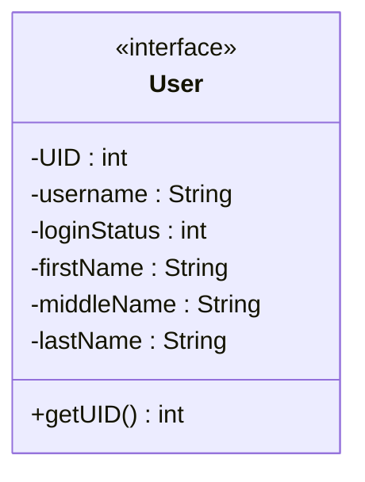

# Classes

```mermaid
classDiagram

class User {
    <<interface>>
    -UID : int
    -username : String
    -loginStatus : int
    -firstName : String
    -middleName : String
    -lastName : String
    +getUID() int
}
```

## UID

